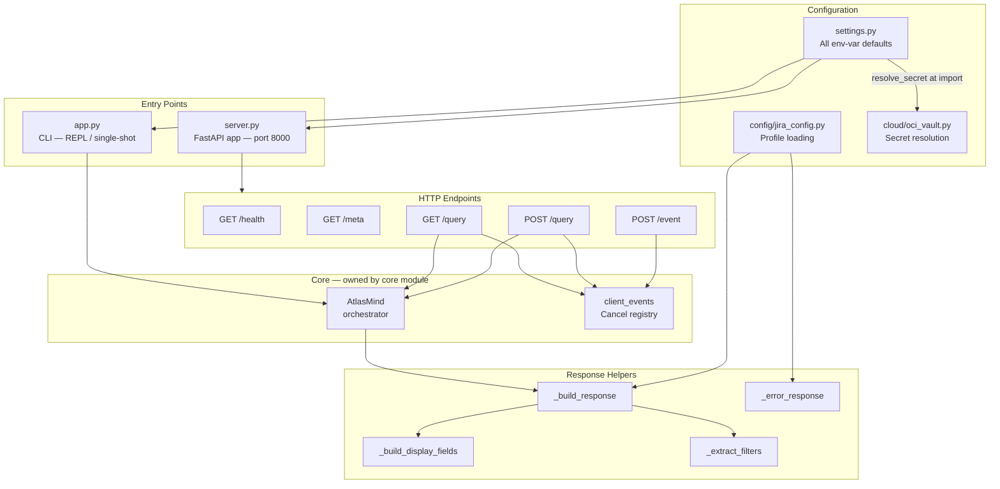

# AtlasMind-Lite: A Natural Language Interface for Jira, Built from Scratch

Every Jira user I have worked with over the years has the same complaint. Not about Jira itself. About JQL. You know what you want. You want the open bugs assigned to you that were created this sprint, sorted by priority. You just cannot remember if it is `issuetype = Bug` or `issueType = Bug`, whether it takes `currentUser()` or just your username, or whether `sprint in openSprints()` is even valid syntax on your server version. So you open the JQL documentation, spend five minutes constructing the query, paste it in, get a validation error, fix it, and then you have what you wanted. Every time.

AtlasMind-Lite is my attempt to fix that loop. You type what you want in plain English. It figures out the JQL, runs it against your Jira instance, and returns structured results with a chart suggestion. The whole thing runs on free-tier LLM APIs, works with local Ollama, and can swap between five different LLM backends without changing anything other than an environment variable.

<!-- more -->

## What it actually does

The core idea is simple: natural language in, Jira results out. But the implementation is not simple, because JQL is not simple. Field names vary between Jira Cloud and Jira Server. Allowed values for fields like status or issuetype are project-specific. The model has no way to know what your sprint is called or what your custom fields are named unless you tell it.

The way AtlasMind-Lite solves this is with a RAG pipeline that is deeply aware of your specific Jira instance. Before the model ever sees your query, the system has already retrieved the three most relevant JQL examples from a local vector store, the five most relevant field descriptions (with allowed values), and any similar values from your Jira field database. The model gets a prompt that looks like: here are some example queries and their JQL, here are the relevant fields and what values they accept, now generate JQL for this query. It produces structured JSON with a `jql` field, an `answer`, and a `chart_spec`.

Then it runs a 7-pass deterministic sanitizer on the output before touching Jira. This catches the common failure modes: LIMIT clauses (which Jira rejects), unquoted multi-word field names, arithmetic in ORDER BY expressions, and numeric values wrapped in quotes. Most of these do not need an LLM to fix. They are pattern issues and pattern matching handles them without spending any tokens.

After that, it validates the JQL against the Jira API with a zero-result search before running the real query. If Jira rejects it, the error goes back into the prompt and the model gets one more chance to fix it. Up to four attempts total.

## The query router

Not every question you ask is a JQL question. "What is the difference between a bug and a task?" is a general question. Sending it through the JQL pipeline is wasteful and produces a bad answer.

The system has a dedicated query router that classifies each query with a fast LLM call before doing anything else. General questions get answered immediately. JQL queries go through the full RAG pipeline. There is also a `/jql` and `/general` flag you can append to any query to force the route if the classifier gets it wrong.

The two-pass approach is used for Ollama specifically. The first call classifies. The second call generates the answer. For cloud backends like Groq, Claude, and vLLM, the same call handles both classification and generation.

## Five LLM backends, one codebase

One of the things I wanted from the start was to not be locked into any single provider. The backend is structured so that every LLM interaction goes through a common interface, and you switch between them with a single environment variable.

The five backends are Ollama (local, default), Groq (cloud), vLLM (GPU inference server), Anthropic Claude direct, and AWS Bedrock. Each has its own client class but they all implement the same `generate_jql` interface. The Claude client adds prompt caching on the system block to reduce token costs on repeated queries. The vLLM client auto-detects the loaded model from the `/v1/models` endpoint so you do not have to specify it manually. If vLLM is unreachable at startup, it falls back to Ollama automatically.

The same LLM client instance is shared between the query router, the chart spec generator, and the JQL generation step. One initialization, consistent behaviour.

## The pgvector knowledge base

All the domain knowledge lives in four pgvector tables, each seeded from a different source and hash-gated so re-encoding only happens when the source files actually change.

`jql_annotations` holds annotated query/JQL pairs, seeded from a markdown file. At query time, the top three nearest examples are retrieved and injected into the prompt. These are the few-shot examples that teach the model what valid JQL looks like for this instance.

`jira_field_annotations` holds field descriptions with allowed values, fetched automatically from the Jira REST API on first run. The top five nearest fields for each query are retrieved and included in the prompt. This is how the model knows that your "Assignee" field is `assignee` and your custom "Squad" field is `customfield_10042`.

`jira_field_values` holds one row per field/value combination for cosine similarity correction. When the model generates a value like `in progress` and your Jira actually has `In Progress`, the sanitizer catches it and corrects it without a retry. Values within a configurable L2 distance threshold are auto-corrected. Values further out but still plausible are injected as hints into the retry prompt.

`jira_asset_values` is for Jira Assets fields, which require AQL syntax and object labels. These are fetched, embedded, and stored the same way as field values.

All four tables are seeded on startup, but seeding is skipped if the source file MD5 has not changed since the last run. You get consistent startup times once the initial seed is done.

## The frontend

The frontend is a separate repo ([AtlasMind-frontendUI](https://github.com/sunishbharat/AtlasMind-frontendUI)) built with Svelte 5 and Vite. It sits between you and the backend as a bridge server on port 8001, which proxies requests to the AtlasMind backend on port 8000.

The UI has three views. The hierarchy map shows epics, stories, and sub-tasks as a linked tree with animated SVG connections. Hovering any card highlights its connections across the other views. The issue table shows the flat backlog with indented hierarchy and synchronized hover state. The AI chart tab renders charts auto-generated from the last query result using Apache ECharts.

The chat panel has two modes. Demo mode uses locally bundled sample sprint data and works with no backend at all. Live mode sends queries to the AtlasMind backend, which generates JQL and queries your Jira instance. When a live query returns results, the view switches automatically to the AI chart tab and additional auto-generated chart tabs appear alongside the one the model specified.

Authentication is handled with a PAT (Personal Access Token) that you enter in the chat panel. It is saved to localStorage and sent as an `X-Jira-Token` header on every request. The backend forwards it to the Jira REST API per-request. No credentials are stored server-side. For Docker or server deployments, you can set `JIRA_PAT` as an environment variable and skip the UI prompt entirely.

## Architecture

## What the query flow looks like end to end

You type "show me all high priority bugs created this week assigned to me" into the chat panel.

The bridge server sends `POST /query` to the backend. The backend registers the request with a cancel token, then calls `AtlasMind.generate_jql()`. The query router makes a fast LLM call and classifies it as a JQL query. The RAG pipeline encodes the query into an embedding vector, runs parallel similarity searches against `jql_annotations` and `jira_field_annotations`, finds similar values in `jira_field_values`, and assembles the full prompt. The LLM generates structured JSON. The sanitizer runs its 7 passes. The system pre-validates the JQL with a zero-result Jira query. If it passes, the real paginated search runs. Results are normalised, enriched with computed fields like `effort_days` and `age_days`, and assembled into a `QueryResponse` with display fields, facet filters, and a chart spec. The bridge receives it and the frontend renders the hierarchy map and chart.

If Jira rejects the JQL, the error is classified by type. A bad field name triggers a similarity search in `jira_field_annotations` to find the closest valid field, and that suggestion goes back into the retry prompt. A bad value triggers a cross-field similarity search in `jira_field_values`. Operator errors and EMPTY search errors are fixed deterministically without LLM involvement. Up to four total attempts, after which it surfaces a clear error rather than silently returning nothing.

## What I learned building this

**The JQL sanitizer saves more retries than the retry loop does.** I added the retry loop first and assumed it would handle most correction cases. What I found was that a large fraction of the errors the model makes are structural, not semantic. LIMIT clauses, unquoted field names, arithmetic in ORDER BY. These are deterministic and cheap to fix. Moving them into a pre-execution sanitizer reduced the average number of Jira API calls per query significantly and made responses faster.

**Seeding is an infrastructure problem, not a data problem.** Getting the vector store populated correctly on first run, and keeping it in sync when the source data changes, turned out to be more work than the embedding itself. The MD5 hash-gated seed manager with a `seed_metadata` table is not elegant, but it solves the real problem: you do not want to wait for re-encoding on every startup, and you do not want stale embeddings after a Jira field configuration change.

**Per-request auth headers are the right model for multi-tenant use.** Baking credentials into server config means one credential per deployment. Forwarding `X-Jira-Token` and `X-Jira-Url` as per-request headers means the same backend instance can serve multiple Jira instances or multiple users with different access levels without a server restart.

**Two modes in the frontend (Demo and Live) actually matter.** It sounds like a nice-to-have. In practice it means anyone can try the UI without configuring a backend, which made it much easier to get feedback from colleagues who were not going to stand up a local instance just to see what it looked like.

## Where the code is

The backend (FastAPI, pgvector, RAG pipeline, all five LLM clients) is at [github.com/sunishbharat/atlasMind-Lite](https://github.com/sunishbharat/atlasMind-Lite).

The frontend (Svelte 5, bridge server, chart rendering, hierarchy view) is at [github.com/sunishbharat/AtlasMind-frontendUI](https://github.com/sunishbharat/AtlasMind-frontendUI).

Both repos have READMEs with setup instructions and configuration details.

---

- Backend: [github.com/sunishbharat/atlasMind-Lite](https://github.com/sunishbharat/atlasMind-Lite)
- Frontend: [github.com/sunishbharat/AtlasMind-frontendUI](https://github.com/sunishbharat/AtlasMind-frontendUI)
