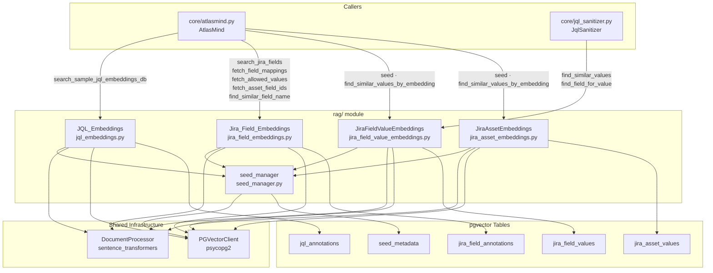

# AtlasMind: My Own AI Assistant for Project Management

*Originally published on [DEV Community](https://dev.to/sunishb/why-i-built-my-own-ai-project-management-assistant-and-what-i-learned-5fc6){ target="_blank" }*

After decades of managing software programs across different industries, I still found myself spending hours each week writing JQL to get my reporting ready. Every project management tool I have worked with is excellent at storing data and painful at visualizing it. Jira is the best of them: it is still painful. The more you start exploring, the more knowledge and skills one needs to adapt to get a valuable result out of it. And even when you got the data, you still had to turn it into something a stakeholder could read: the right chart, in the right format, without a tutorial.

Different reports for different audiences with a variety of charts: everyone needed a different view of the same data. Should I export to Excel and create a pivot table, or use dashboard reports by manually creating each type of chart, or use a third-party vendor tool? The choices are many but integration effort and future reliability are always a question. And there is the added burden of knowing how to query using JQL, SQL, MDX, or whatever the tool demands.

<!-- more -->

To overcome all of these problems, I turned to AI, offloading the heavy lifting and focusing on letting it generate the right charts and queries. This is what **AtlasMind** does: give it a question in plain English about your project and you get charts rendered with tables that can be filtered and used for reports with a single click.

AtlasMind is live at [atlasmind.de](https://atlasmind.de){ target="_blank" }. It runs against the public Apache Jira server. Here is what it looks like in practice:

```
User  : show me all open bugs in project Kafka ordered by priority

JQL   : project = KAFKA AND issuetype = Bug
        AND status not in ('Closed', 'Resolved')
        ORDER BY priority DESC

Answer: Open bugs in Kafka project ordered by priority.
        Found 2170 result(s); showing 1000.
```


*Type a question in plain English. Get JQL, a chart, and an answer in seconds.*

**Links:**

- Live: [atlasmind.de](https://atlasmind.de){ target="_blank" }
- Frontend: [github.com/sunishbharat/AtlasMind-frontendUI](https://github.com/sunishbharat/AtlasMind-frontendUI){ target="_blank" }
- Backend: [github.com/sunishbharat/atlasMind-Lite](https://github.com/sunishbharat/atlasMind-Lite){ target="_blank" }

## Architecture

### Query Router

It classifies the user query into three paths: a general pipeline, a JQL pipeline, or direct chart rendering. This keeps every query type on the most efficient path without wasted inference calls.

### RAG Pipeline

When a query is classified as JQL, it follows the RAG pipeline. The system uses Sentence Transformers and pgvector to store JQL annotations, Jira fields, and associated values as embeddings. At query time, the user's question is embedded and compared against stored vectors. The system pulls the top 5 nearest neighbours using L2 distance between the query and available Jira fields.



### LLM Orchestrator

This layer acts as a backend switch, routing to whichever active backend the system selects: Groq, Ollama, Claude, and others. Each backend is a separate async client module, making them independently swappable with no core changes.

### Self-Correcting JQL Loop

Before the LLM-generated JQL reaches the Jira API, it goes through a 7-pass sanitizer. These seven passes handle the most common LLM failure modes without any LLM call, making the system more robust. After sanitization, the JQL is executed against the Jira REST API, and this is where the agentic feedback loop begins. The loop runs up to *n* retries. When Jira identifies a specific invalid field by name, the prompt tells the LLM to remove exactly that field condition, not to guess or hallucinate replacements. This surgical assertion makes the LLM generate deterministic, valid JQL.

### Multi-Backend Architecture

During the initial development phase, I built the first version using a local Ollama model: zero cost, zero API tokens, zero cloud dependency. Later I extended it to support other free-tier and paid models, which delivered meaningfully better performance and JQL generation quality. The multi-backend design keeps development costs at zero while making production upgrades frictionless.

### Deployment

AtlasMind runs on an Oracle Cloud Infrastructure A1 instance with PostgreSQL + pgvector, Groq as the default backend, Ollama as the fallback, and the Svelte frontend, all on one machine. For heavier inference there is also support for a local GPU system running vLLM with a quantized 7B Qwen2.5-Coder model over HTTP. When the GPU system is offline, AtlasMind falls back to Ollama automatically with no configuration change or restart required.

## What I Learned

**Load testing is a gap.** I have not tested AtlasMind under concurrent users at scale. Likely bottlenecks are pgvector query time under high vector search volumes, Jira API rate limits under parallel requests, and LLM inference latency under load. For a side project built during evenings and weekends, discovering these failure modes is a real challenge in itself.

**LLMs still cannot generate JQL reliably on their own.** Multiple trial-and-error cycles with surgical assertions still do not make it fully dependable. Fine-tuning against a specific Jira instance's schema would get JQL generation accuracy significantly higher. This is an open area I intend to explore.

**Building from scratch is worth it.** I deliberately avoided Langchain and Langgraph and built the RAG pipeline and agentic loop raw. Understanding what is happening under the hood - every embedding lookup, every retry cycle, every routing decision - made me a better architect of these systems. I am equally curious to see how the results change when built on standard libraries.

AtlasMind is what I wish existed across every program I have ever run. I built it to prove that the gap between engineering execution and project intelligence can be closed.

---

- Live project: [atlasmind.de](https://atlasmind.de){ target="_blank" }
- Frontend source: [github.com/sunishbharat/AtlasMind-frontendUI](https://github.com/sunishbharat/AtlasMind-frontendUI){ target="_blank" }
- Backend source: [github.com/sunishbharat/atlasMind-Lite](https://github.com/sunishbharat/atlasMind-Lite){ target="_blank" }
