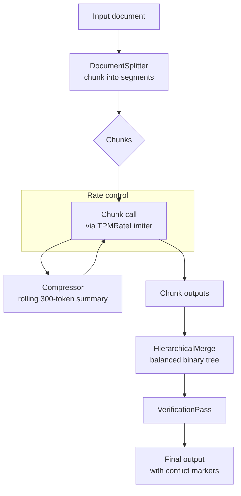

# limitless-llm: Large Documents on Free-Tier LLMs That Actually Work

Every time I tried to process a large document through a free-tier LLM API, the same thing happened: the first few calls went fine, then a `429 Too Many Requests` error showed up mid-pipeline, the job crashed, and I got back nothing. Not a partial result with a warning. Just a crash and an empty output.

The frustrating part was not the rate limit itself. Free tiers exist for a reason, and 12,000 TPM is genuinely useful. The frustrating part was that there was no library that made the free tier *reliable*. Every example I found assumed either a paid API with no TPM cap, or a local model with no network constraints. Neither applied to what I was actually building.

So I built [limitless-llm](https://github.com/sunishbharat/limitless-llm), an open-source Python tool that solves two problems inherent to free tiers: strict TPM rate limits and small effective context windows. The goal is >= 90% fidelity compared to the same workflow on a paid setup. The point is not to make it fast. The point is to make it reliable.

<!-- more -->

## The two problems free tiers create

Free-tier LLM APIs are limited in two ways that interact badly with large document processing.

The first is **TPM limits**. Groq's free tier for `llama-3.3-70b-versatile` allows 12,000 tokens per minute. A 20,000-token document needs to be broken into chunks and processed sequentially, which means you're almost certainly hitting the cap mid-pipeline. Most naive implementations either sleep for a fixed interval between calls (wasteful) or don't rate-limit at all (crashy). Neither works for a tool you actually want to rely on.

The second is **context window pressure**. Even with a 128k context window, you can't feed a large document as a single prompt and expect coherent output. You need to chunk it. But naive chunking breaks sentences mid-thought, drops context across chunk boundaries, and produces output where the end of one chunk contradicts the beginning of the next. If you're summarising a technical specification, you can't afford that.

Both problems are solvable. But they require different mechanisms, and I hadn't found a library that addressed both together.

## How the pipeline works

The architecture is a sequential pipeline with five stages:



### Rate limiting that actually works

The rate limiter uses a rolling 60-second window. Before each API call, it measures actual input tokens, reserves budget atomically, and records actual usage after. This eliminates 429 errors without fixed sleeps. When the budget is exhausted, it waits exactly as long as needed, nothing more.

On the rare 429 that still slips through (usually due to API-side measurement differences), the limiter honours the `retry-after` header and backs off correctly. In practice, across all my test runs on 20k+ token documents, I have not seen a failed call after the rate limiter was in place.

### Context continuity across chunks

The sentence-aware splitter keeps chunks at the token boundary you configure (default 6,000 tokens) without bisecting sentences. Each chunk sees a **200-token tail** of the previous section plus a **rolling 300-token compressed summary** of everything processed so far. This means defined terms, forward references, and contextual setup from earlier sections survive across chunk boundaries.

The compressor runs after each chunk call and produces a short summary that gets prepended to the next chunk's prompt. It is designed to stay well within the TPM budget as part of the normal chunk cycle.

### Merging without losing information

Chunk outputs are merged in a balanced binary tree. Chunk 1 + chunk 2 produce merge A, chunk 3 + chunk 4 produce merge B, then merge A + merge B produce the final output. This keeps individual merge prompts manageable regardless of document length. A 20k-token document produces roughly 4 chunks and 3 merge calls.

When chunk outputs contain contradictory facts (which happens when the same entity is described differently in different sections), the merger inserts `[CONFLICT: ...]` markers and collects them in a structured summary at the end. These are not silently dropped. They are surfaced for human review.

### Verification

After the hierarchical merge, a verification pass compares the merged output against the accumulated fact ledger and appends a short report. Honestly, it is a single LLM call with the ledger and the merged output, asking for a factual consistency check. It does not replace careful human review. It catches the obvious failures.

## Getting started in three minutes

The fastest path is the CLI:

```bash
git clone https://github.com/sunishbharat/limitless-llm.git
cd limitless-llm
uv sync
export GROQ_API_KEY=your_key_here
uv run limitless-llm run my_document.txt
```

Save to a file:

```bash
uv run limitless-llm run my_document.txt --output result.txt
```

For a smaller chunk size on dense or symbol-heavy documents:

```bash
uv run limitless-llm run my_document.txt --chunk-size 3000
```

## Using it programmatically

The CLI wraps a single pipeline call. To integrate it into your own application, use the Python API directly:

```python
import asyncio
from limitless_llm import PipelineFactory
from limitless_llm.models.config import ModelConfig, PipelineConfig

config = PipelineConfig(
    model=ModelConfig(model="groq/llama-3.3-70b-versatile"),
    input_text=open("my_document.txt").read(),
)
result = asyncio.run(PipelineFactory.build(config).run())
print(result)
```

For a more realistic use case like reviewing a large technical specification, you can customise both the system prompt and the per-chunk template:

```python
REVIEW_SYSTEM_PROMPT = (
    "You are a senior technical reviewer. Read each section carefully "
    "and produce a structured review covering: correctness, risks, "
    "ambiguities, and concrete suggestions."
)

config = PipelineConfig(
    model=ModelConfig(
        model="groq/llama-3.3-70b-versatile",
        max_output_tokens=1500,
        baseline_chunk_size=6000,
    ),
    input_text=document_text,
    system_prompt=REVIEW_SYSTEM_PROMPT,
)
```

The model string follows the LiteLLM convention (`provider/model-name`), so switching from Groq to a local Ollama instance or a paid OpenAI endpoint is a one-line change.

## Supported models and the honest tradeoffs

| Model | Context window | Free-tier TPM | Notes |
|---|---|---|---|
| `groq/llama-3.3-70b-versatile` | 128,000 | 12,000 | Default |
| `groq/llama-3.1-8b-instant` | 128,000 | 20,000 | Higher TPM allowance |
| `groq/llama3-70b-8192` | 8,192 | 12,000 | Genuinely 8k window |
| `openai/gpt-4o` | 128,000 | Unlimited | Paid, rate limiter becomes a no-op |
| `ollama/llama3.2` | 32,768 | Unlimited | Local, no network limit |

For a 20,000-token document on the default Groq free tier, expect roughly 9 total LLM calls (4 chunks + 4 compressions + 1 merge) at about 1.25 calls per minute when TPM-saturated. That works out to 3 to 4 minutes end-to-end. That is the honest free-tier tradeoff. The library makes it reliable rather than fast.

One important constraint: **single-process only**. The TPM rate limiter tracks usage in-memory per process. Running two instances simultaneously against the same API key will each see the full TPM budget independently and can trigger 429 errors. For multi-process use, a Redis backend is the upgrade path. The `limits` library supports this with a one-line storage swap.

## What I actually learned building this

**The rate-limit problem is a distributed systems problem in miniature.** The naive approach of sleeping between calls wastes time and still crashes if the sleep interval doesn't match the API's rolling window. Getting the rolling window implementation right required thinking carefully about what "atomic budget reservation" means in a single-process async context, and what happens when actual token usage differs from estimated usage. It's the same class of problem as managing a database connection pool, just at smaller scale.

**Bidirectional context matters more than chunk size.** My early versions used larger chunks to reduce the number of API calls. What I found was that information loss at chunk boundaries caused more problems than the extra calls. Reducing the chunk size and adding bidirectional overlap (tail of previous + rolling summary) produced much better output than a single large chunk that saturated the context window. A model given 80% of the context it needs performs worse than a model given 100% of a smaller context with a good summary of what came before.

**Conflict detection earns its keep on real documents.** I added conflict markers expecting them to trigger rarely. On actual technical documents like specifications, design docs, and onboarding materials that evolved over time, they triggered more often than I expected. Sections written at different times often contain subtly different facts about the same entity. Surfacing those automatically is genuinely useful.

**Code-heavy documents are an open problem.** The sentence-aware splitter does not protect code block boundaries. Documents where more than about 20% of content is code will have code blocks bisected at chunk boundaries, which degrades output quality significantly. This is the most important known limitation. A structure-aware splitter that respects code block boundaries is the right fix and I have not built it yet.

## What's next

The two open areas I want to address are ledger pruning (the fact ledger grows unbounded right now and can exceed the context window on very long documents) and structure-aware splitting for code-heavy documents. Both are in [CONTRIBUTING.md](https://github.com/sunishbharat/limitless-llm/blob/main/CONTRIBUTING.md) as open contribution areas if you want to pick one up.

If you're processing large documents on free-tier LLMs and hitting rate limits, this is the starting point I wish I'd had. The free tier is more capable than most people treat it. It just needs the right wrapper around it.

---

- Source code: [github.com/sunishbharat/limitless-llm](https://github.com/sunishbharat/limitless-llm)
