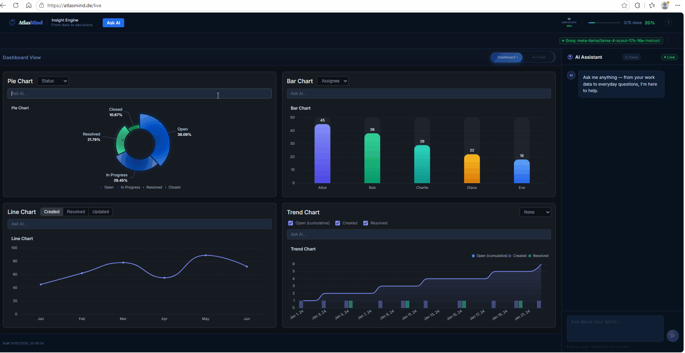

# Sunish Bharathan

Open to AI delivery &amp; engineering leadership roles &middot; Europe

### Leads programs. Writes code. Delivers AI.

I bridge engineering execution and business delivery &mdash; taking complex, multi-team software from regulated embedded systems all the way to production LLM deployments.

[View Projects :material-arrow-right:](portfolio/index.md){ .md-button .md-button--primary }
[Get in Touch](#contact){ .md-button }

<!-- Hero visual: live AtlasMind product demo. Swap to a headshot any time by changing the src below. -->

[atlasmind.de :material-arrow-top-right:](https://atlasmind.de){ .demo-caption target="_blank" rel="noopener" }

  

    20+ yrs
    Delivering complex, multi-team software programs
  

  

    ASIL-B &middot; ASPICE L2
    Shipping inside highly regulated environments
  

  

    AtlasMind LLM backends
    Runtime-switchable &mdash; Ollama, vLLM, Groq, AWS Bedrock, OpenAI-compatible
  

## About

I deliver complex, multi-team software programs in highly regulated environments (ASIL-B, ASPICE L2). With 20+ years of experience, I bridge the gap between engineering execution and business delivery.

I specialize in cross-team integration, task-level dependency tracking, and setting up Agile governance structures from scratch. I maintain a hands-on focus in embedded systems and modern generative AI architectures.

## Skills

A rare combination: **safety-critical program delivery** and hands-on **production GenAI**.

-   **Delivery & Management**

    ---

    - SAFe (Certified Agilist)
    - Scrum / Kanban / PI Planning
    - ASPICE L1/L2 & ASIL-B
    - Audit Artifact Automation
    - PMO Scaling & Governance

-   **AI & Software Systems**

    ---

    - RAG & pgvector (embeddings)
    - LLM Routing (Ollama, vLLM)
    - Python (FastAPI, PyTorch)
    - C / C++ (Embedded & RTOS)
    - Docker / Linux / DevOps

-   **Tools & Platforms**

    ---

    - Jira & EazyBi Dashboards
    - Agile Hive / Confluence
    - Jenkins CI/CD Pipelines
    - Oracle Cloud (OCI) & AWS
    - Git & Version Control

## Featured Projects

-   **AtlasMind: Production AI Assistant**

    ---

    A live natural language to JQL dashboard and query tool using RAG and pgvector. Features runtime LLM routing across 5 backends, self-healing query retries, and GPU inference. Deployed solo on Oracle Cloud A1.

    `Python` `FastAPI` `pgvector` `Ollama` `vLLM` `Oracle Cloud`

    [Read more :material-arrow-right:](portfolio/projects/atlasmind.md)

-   **GPT-2 Transformer From the Ground Up**

    ---

    Built a functional GPT-2 transformer architecture from scratch in Python to understand tokenization, multi-head attention mechanisms, feedforward layers, training loops, and language model inference.

    `Python` `PyTorch` `Tokenization` `Deep Learning`

    [Read more :material-arrow-right:](portfolio/projects/gpt2.md)

[View all projects :material-arrow-right:](portfolio/index.md)

## Featured Articles

-   **Why I Built My Own AI Project Management Assistant**

    ---

    *May 22, 2026 - 8 min read*

    The story of building AtlasMind - a plain-English to JQL query engine with a self-correcting agentic loop, RAG pipeline, and multi-backend LLM routing. Deployed solo on Oracle Cloud.

    [Read article :material-arrow-right:](blog/posts/atlasmind.md)

-   **Building a RAG Pipeline with Docling and pgvector: Without LangChain**

    ---

    *June 5, 2026 - 10 min read*

    How I built a production RAG pipeline without LangChain - PDF parsing, structured table extraction with Docling, and vector search with pgvector directly on PostgreSQL.

    [Read article :material-arrow-right:](blog/posts/docling-pgvector.md)

[View all articles :material-arrow-right:](blog/index.md)

## Contact { #contact }

I am open to discussing technical program management, engineering leadership, or AI delivery roles across Europe. **Available for contract or full-time.**

[sunishb@gmail.com](mailto:sunishb@gmail.com){ .md-button .md-button--primary }
[LinkedIn :fontawesome-brands-linkedin:](https://linkedin.com/in/sunishbharathan){ .md-button target="_blank" }
[GitHub :fontawesome-brands-github:](https://github.com/sunishbharat){ .md-button target="_blank" }
[atlasmind.de :material-arrow-top-right:](https://atlasmind.de){ .md-button target="_blank" }
