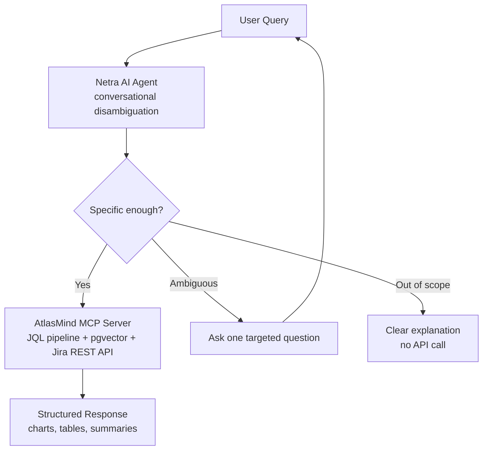

# AtlasMind-Netra: AI Agent and MCP Server for Jira

!!! abstract "Summary"
    **Type**: Extension of the AtlasMind production system
    **Stack**: Python, PydanticAI, MCP, Groq, FastAPI

    **Key outcomes:**

    - Single targeted clarification question per ambiguous query - never more
    - Learns team conventions and never asks the same question twice
    - MCP server usable from Claude Code, Cursor, Claude Desktop, and any MCP-compatible client
    - `show_in_ui` flag injects results directly into the live AtlasMind browser UI
    - Stateless agent architecture - full conversation history passed per request, inspectable at every turn

## Challenge

The original AtlasMind pipeline converted plain-English questions to JQL and returned results. It worked, but ambiguous queries - "show me the open issues", "what's blocked?", "list the critical tickets" - produced wrong results confidently. Each of those questions is valid. None has a single correct answer without more context.

The system needed a way to handle underspecification: identify when a query lacks enough information to dispatch correctly, ask exactly one targeted question, and then proceed. Asking multiple questions before doing anything is not useful in practice. Users stop engaging.

## Approach

Built a two-layer system on top of the existing AtlasMind backend:

**Layer 1 - Netra Agent (conversational disambiguation)**

The agent classifies every incoming query into one of three paths:

1. Specific enough - dispatch immediately to the MCP toolchain
2. Ambiguous in one identifiable way - ask one targeted question covering the underspecified dimension (project scope, time window, status filter, assignee, issuetype), then dispatch
3. Out of scope - return a clear explanation without touching the Jira API

Classification is a single LLM call against a structured prompt encoding the known ambiguity categories. Resolved conventions (e.g. "blocker" always means `priority = Blocker` in this team's context) are stored and applied automatically on future queries - the same clarification is never asked twice.

**Layer 2 - MCP Server (execution)**

Once the query is ready to dispatch, the MCP server handles tool execution: JQL generation, pgvector field lookup, sprint context retrieval, issue detail fetching. Exposing these as MCP tools rather than a custom REST API makes the same toolchain available to any MCP-compatible client without additional integration work.

## Architecture

## show_in_ui: Live Browser Chart Rendering

With `show_in_ui=true`, results are injected directly into the AtlasMind browser UI via a bridge server and SSE stream. The browser renders tables and ECharts visualisations client-side. No rendered binaries flow through Netra-mcp. The inject is best-effort - if no tab is connected, the data result is unaffected.

## Tech Stack

| Layer | Technology |
|---|---|
| Agent framework | PydanticAI |
| MCP server | Python MCP SDK |
| Clarifier LLM | Groq (fast model for disambiguation, higher-quality for JQL) |
| Backend | AtlasMind FastAPI backend, pgvector |
| UI bridge | SSE / FastAPI bridge server |
| Session state | In-memory (Redis upgrade path designed in) |

## Links

[Frontend (GitHub) :fontawesome-brands-github:](https://github.com/sunishbharat/AtlasMind-frontendUI){ .md-button target="_blank" }
[Backend (GitHub) :fontawesome-brands-github:](https://github.com/sunishbharat/atlasMind-Lite){ .md-button target="_blank" }
[Live Site :material-arrow-top-right:](https://atlasmind.de){ .md-button .md-button--primary target="_blank" }
[Read the blog post :material-arrow-right:](../../blog/posts/atlasmind-netra-mcp-server.md){ .md-button }
